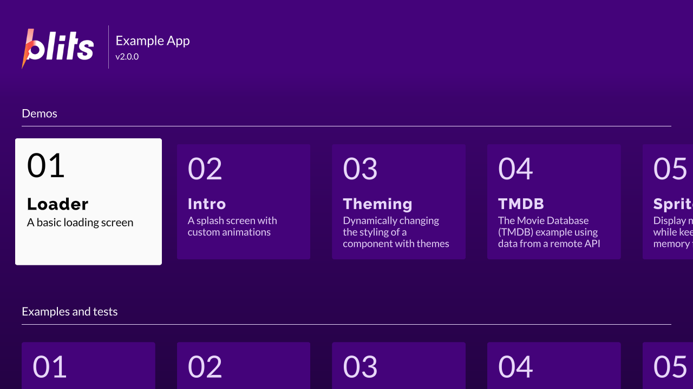

**What you are looking at:** not a demo written for ScreenKit. This is
[upstream's own Blits example app](https://github.com/lightning-js/blits-example-app), pinned to a
commit, with **`src/` unmodified except for one commented-out page**. The Portal home screen renders,
the card grid is laid out, the first card has focus, and four MSDF fonts are in use.

The value of this example is exactly that nobody here wrote it. A demo built for a runtime proves
the demo works. Somebody else's app proves the runtime does.

## What it proves

| Exercised | How |
|---|---|
| A real routing app | pages, focus, a card grid |
| A **lazy `import()`** | the `/demos/loading` page is a separate chunk, resolved at build time and packed — see [the build pipeline](/start/build-pipeline/) |
| Four MSDF fonts | including a web font loaded from its atlas |
| Remote input | arrows move focus one card at a time, Enter opens a page, Back returns |
| Vite 8 + plugin-legacy 8 | the newer toolchain half of the fleet |

## What does not work, stated plainly

This app reaches past what the runtime does today, which is why it is useful:

- **The video player page is commented out.** `shaka-player` needed `<video>` and Media Source
  Extensions and failed at import. [`@screenkit/shaka`](/reference/shaka/) is the answer to that now,
  but this page has not been revisited.
- **The TMDB page and remote images** need network access to a live API.
- **The Firebolt page** needs a Firebolt device.

Every ScreenKit-specific change is marked in the source with a `ScreenKit:` comment, and its
`package.json` carries two more: workspace dependencies instead of `file:` paths, and `backstopjs`
removed — upstream's visual-regression suite needs a browser this runtime does not have, and it was
the only source of high-severity advisories in the whole workspace.

## Run it

```sh
npm run build:screenkit -w @lightningjs/blits-example-app
runtime/build/macos/screenkit-host --window examples/blits-example-app/app.skpkg
```
