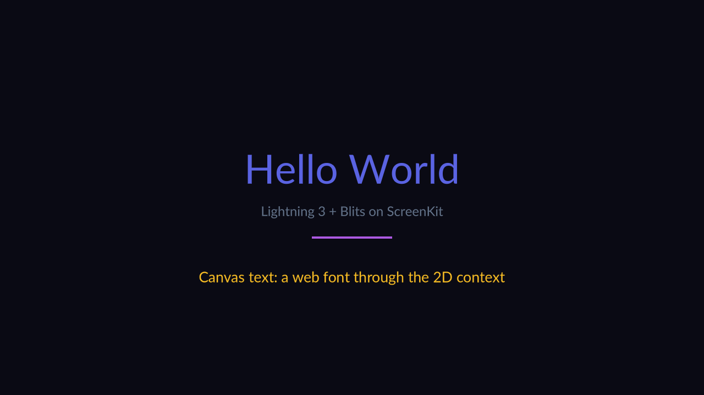

**What you are looking at:** the app that defines a milestone. M6's exit criterion is *"unmodified
Lightning 3 renders a real UI with text"*, and every glyph above is that criterion being met.

The text is not one thing. "Hello World" and the grey subtitle come from **MSDF atlases generated at
build time** — signed-distance fields Lightning samples in a shader, which is why they stay crisp at
any size with no font rasteriser in the runtime. The amber line is the other path entirely:
**`fillText` on a 2D canvas**, with glyphs from SDL3\_ttf, uploaded as a texture.

## What it proves

| Exercised | How |
|---|---|
| Lightning 3's WebGL renderer | unmodified, from npm |
| Blits' component model | the layout and the colour-cycling accent bar |
| MSDF text | Blits' own `msdfGenerator` Vite plugin writes the atlases into the build; `screenkit bundle` copies them into the package |
| Canvas 2D text | the amber line, a web font through the 2D context |

## Why MSDF and not a font engine

A TV UI needs crisp text at a distance, and a runtime that ships FreeType and HarfBuzz is a much
bigger runtime. Lightning's answer — bake the glyphs into a signed-distance atlas at build time and
sample them in a shader — costs no runtime font machinery at all.

The trade is real and worth knowing before you commit:

- No arbitrary runtime font loading.
- No complex-script shaping unless it was baked ahead of time.
- A fixed glyph set per font.

Right for a TV UI; wrong for a text-heavy app. And `screenkit bundle`
**fails the build on a font without its atlas**, rather than shipping an app that renders nothing
where text should be.

## Run it

```sh
npm run build:screenkit -w screenkit-example-lightning3-blits
runtime/build/macos/screenkit-host --window examples/lightning3-blits/app.skpkg
```
