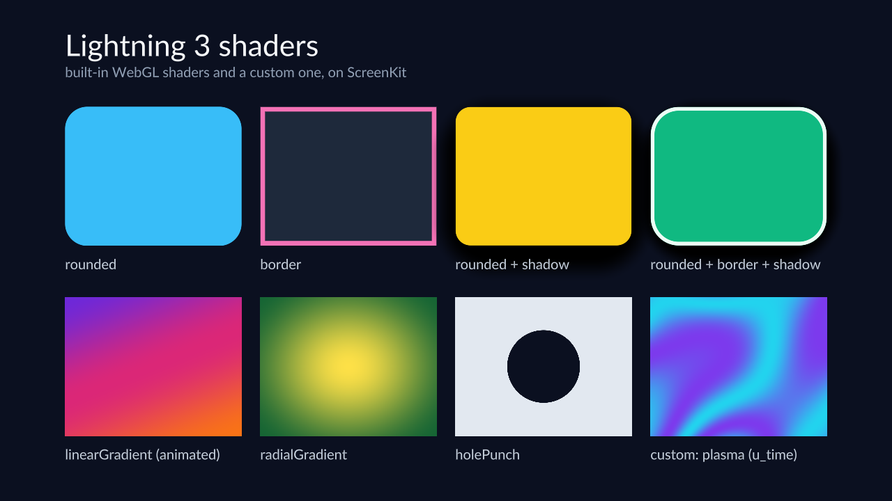

**What you are looking at:** eight different shader programs on screen at once, each labelled with
what it is. This puts far more on the GPU than a hello world, and each tile fails visibly and
distinctly if its shader is wrong — a missing `holePunch` is an unbroken rectangle, a broken
`radialGradient` is a flat fill.

The bottom-right tile is a **custom plasma shader driven by `u_time`**, so it redraws every frame.
If the runtime ever stopped feeding uniforms per frame, that tile would freeze while the other seven
kept looking correct.

## What it proves

| Exercised | How |
|---|---|
| Eight distinct shader programs | rounded, border, shadow and their combinations |
| Uniform arrays | the gradient stops and colours |
| Reactive shader props | values changing per frame from JS |
| A timed shader | `u_time` on the custom plasma tile |
| Alpha and shadow compositing | the drop shadows on the top row |

## Why this one matters for a port

A hello world proves the GL entry points exist. This proves the **object model** around them holds
up: uniform arrays, per-frame uniform updates, and several programs alive at once, each with its own
state. It is the example that catches a GL layer that works for one program and falls apart with
eight.

## Run it

```sh
npm run build:screenkit -w screenkit-example-lightning3-shaders
runtime/build/macos/screenkit-host --window examples/lightning3-shaders/app.skpkg
```
