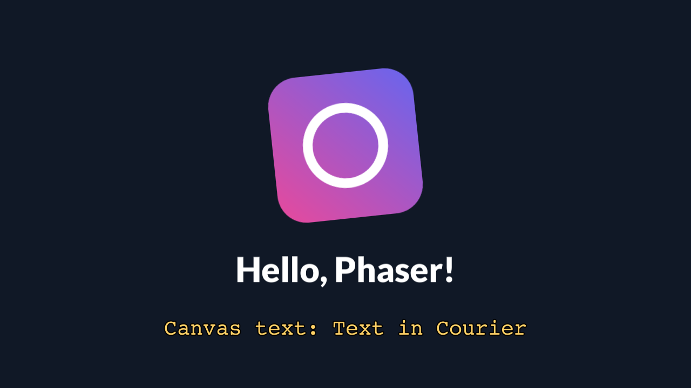

**What you are looking at:** deliberately the same scene as
[the Pixi hello world](/examples/pixi-hello/) — the same logo, the same layout, the same two text
paths — drawn by a different engine. Put the two screenshots side by side and the only differences
are the engine's own text rendering and the font each one picked.

That is the point. Two engines, two renderers, one runtime, and neither was modified to get here.

## What it proves

`src/main.js` is plain Phaser 4: `Phaser.Game` with `type: WEBGL` and `Scale.RESIZE`, a scene with
`preload` and `create`, `load.image`, `load.bitmapFont`, tweens.

| Exercised | How |
|---|---|
| Phaser's WebGL renderer | `type: WEBGL` on the page's frame canvas |
| `load.bitmapFont` | the title, from `lato-black-plain.xml` + `.png` in the package |
| A 2D canvas probe at import | Phaser tests blend modes on a 2D canvas as it loads — one of the reasons [the software 2D subset](/reference/environment/#canvas2d) exists |
| `Scale.RESIZE` | resize events from the drawable |
| Tweens | the spin and pulse, on `requestAnimationFrame` |

## Run it

```sh
npm run build:screenkit -w screenkit-example-phaser-hello
runtime/build/macos/screenkit-host --window examples/phaser-hello/app.skpkg
```
