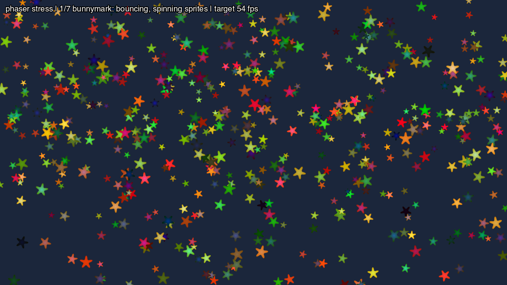

**What you are looking at:** the same phase, at the same point, as
[the Pixi stress test](/examples/pixi-stress/) — and that is the whole design. Compare the two
screenshots: same stars, same status line, same target. Only the engine underneath differs.

## Why it is a copy

`src/stress.js` is the same file in both apps. It owns:

- the load schedule and the measurement,
- and **all the game logic that is not the engine's** — the level, the enemy physics, the bullet
  patterns, the puzzle board.

So both engines run identical JavaScript and differ only in their own rendering. A gap between the
two numbers is a fact about the engines, not about which app happened to be written more carefully.

The full procedure and the seven phases are described on
[the Pixi stress page](/examples/pixi-stress/#how-the-measurement-works).

## What this one adds

Phaser drives the GL differently from Pixi, and exercises different parts of the shim on the way to
the same picture — its own texture batching, its own blend-mode handling, and a 2D canvas probe at
import. Running both is how you tell a runtime problem from an engine problem: when one engine
stumbles on a phase and the other does not, the phase is not the suspect.

## Run it

```sh
npm run build:screenkit -w screenkit-example-phaser-stress
runtime/build/macos/screenkit-host --window examples/phaser-stress/app.skpkg
```

On a Pi:

```sh
sh tools/batocera/pi.sh bench phaser-stress   # writes out/phaser-stress.json
```
