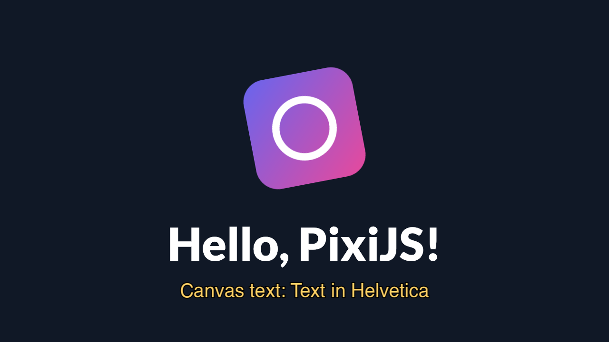

**What you are looking at:** the Pixi logo, spinning and pulsing, above two pieces of text. The big
one is a **bitmap font**; the amber line below it is **`fillText` on a 2D canvas, uploaded to WebGL
as a texture**. Those are two different paths through the runtime, and the screenshot shows both
working at once.

## What it proves

`src/main.js` is plain Pixi 8 — `Application` with `resizeTo: window`, `Assets.load`, a `Sprite`,
`BitmapText`, the ticker. Nothing in it knows it is on a television.

| Exercised | How |
|---|---|
| WebGL 1 through the DOM shim | Pixi's renderer, on the page's frame canvas |
| `Assets.load` | reads the texture out of the package, not the network |
| Bitmap text | the crisp "Hello, PixiJS!" |
| [Canvas 2D as a texture source](/reference/environment/#canvas2d) | the amber line: `fillText` with SDL3\_ttf glyphs, then uploaded |
| `resizeTo: window` | the drawable's size, reported through `window` |

## The one thing an app has to know

Pixi creates a Web Worker to decode textures unless you tell it not to, and
[there are no Workers](/reference/environment/#absent-by-design):

```js
import { Assets } from 'pixi.js'
Assets.setPreferences({ preferWorkers: false })
```

Browsers accept the same preference, so this is not a fork of your app — it is one line that is true
everywhere. Without it, the first texture load throws `ReferenceError`.

## Run it

```sh
npm run build:screenkit -w screenkit-example-pixi-hello
runtime/build/macos/screenkit-host --window examples/pixi-hello/app.skpkg
```

This is also the app the Android script bundles by default:
`sh tools/android/android.sh build` packs `examples/pixi-hello` into the APK.
