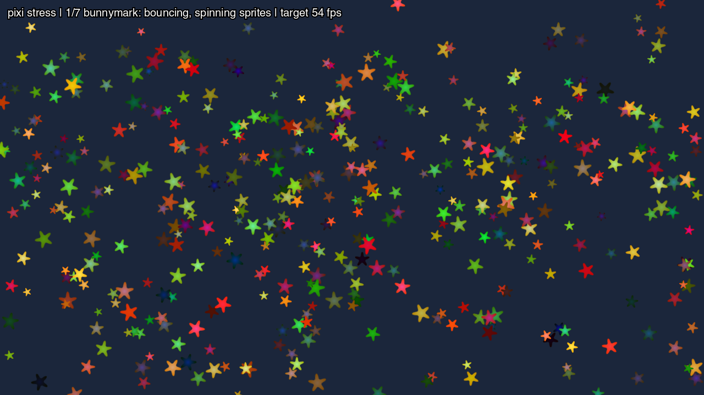

**What you are looking at:** phase 1 of 7, mid-measurement. The status line at the top says which
phase is running and what frame rate it is holding to. Every star is a sprite being bounced and
spun, and the count is still climbing — the run adds about 30% more load every second for as long as
the frame rate holds.

## How the measurement works

This is not a demo that happens to be busy. It is a procedure:

1. **Baseline** — a nearly empty screen, to learn the rate the display actually presents at. The
   target is 90% of that, capped at 54 fps, so a 120 Hz panel is not held to 108.
2. **Each phase** starts light and grows the load by ~30% per one-second window, for as long as the
   rate holds the target.
3. **Two slow windows in a row** at one load end the phase — one slow window is often just the cost
   of creating the new objects.
4. The result is **the largest load that held the target**.

A starting load that never holds is halved and the scene rebuilt, so a slow device still produces a
number rather than a failure; a `0` means the scene itself is already too much.

## The seven phases

| Phase | Load unit | What it stresses |
|---|---|---|
| bunnymark | sprites | raw sprite throughput |
| platformer | enemies | tilemap, parallax, tile physics |
| shooter | bullets | bullet patterns, additive blending |
| particles | particles | explosion bursts |
| puzzle | gems | an animated match-3 board |
| vector | shapes | shapes redrawn every frame |
| text | texts | canvas text changing every frame |

The last two are the interesting ones for this runtime: *vector* and *text* hammer the
[software 2D canvas](/reference/environment/#canvas2d), which is CPU work, not GPU work.

## Why there are two of these

`src/stress.js` is **the same file** in `pixi-stress` and
[`phaser-stress`](/examples/phaser-stress/). It owns the load schedule, the measurement and all the
game logic that is not the engine's — the level, the enemy physics, the bullet patterns, the puzzle
board. Both engines therefore do identical JavaScript work and differ only in their own rendering,
so the two sets of numbers can be compared.

## Run it

```sh
npm run build:screenkit -w screenkit-example-pixi-stress
runtime/build/macos/screenkit-host --window examples/pixi-stress/app.skpkg
```

On a Pi, where the numbers are the point:

```sh
sh tools/batocera/pi.sh bench pixi-stress   # writes out/pixi-stress.json
```

Options come from the URL in a browser (`?phases=platformer,shooter`, `?target=30`, `?webgl=2`) and
from the build otherwise (`VITE_PHASES`, `VITE_TARGET`, `VITE_WEBGL`). Each window logs a line, and
the run ends with one `result {json}`.
