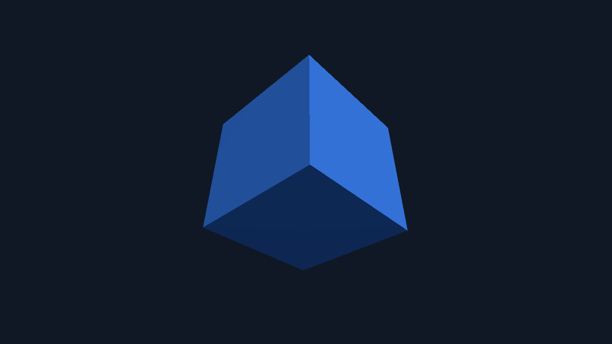

**What you are looking at:** one cube, three visible faces, each a different shade. That shading is
the whole test — it means a real light is being evaluated per fragment and the depth buffer is
sorting the faces correctly. A flat silhouette would mean something had quietly fallen back.

## What it proves

`src/main.js` is plain three.js 0.186: `WebGLRenderer`, `PerspectiveCamera`, `MeshStandardMaterial`,
an ambient and a directional light, `setAnimationLoop`, and a `resize` handler.

`MeshStandardMaterial` is physically based — it compiles a substantial shader, so this is a
meaningfully harder ask of the GL layer than a sprite.

## The one that does not run everywhere

:::caution[three.js requires WebGL 2]
That means GLES 3. This example is **not deployed to the Raspberry Pi**, and on any GLES 2-only
device `getContext('webgl2')` returns `null` and three.js will not start.

It is in the fleet precisely because it is the app that finds that edge. Lightning 3 targets
WebGL 1, so a Lightning UI is unaffected — see [Targets](/reference/targets/#graphics).
:::

## Run it

```sh
npm run build:screenkit -w screenkit-example-threejs-cube
runtime/build/macos/screenkit-host --window examples/threejs-cube/app.skpkg
```
